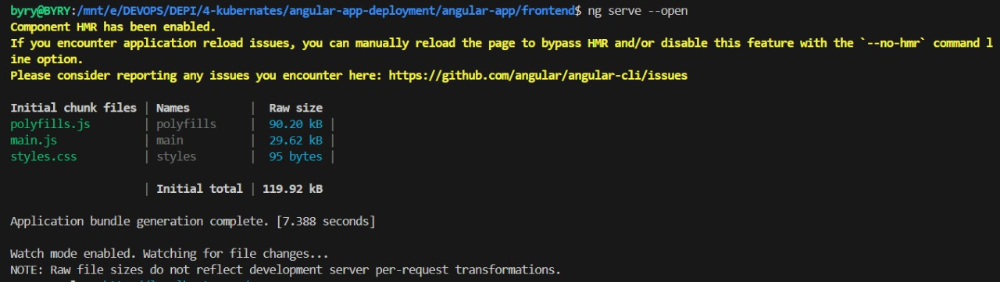
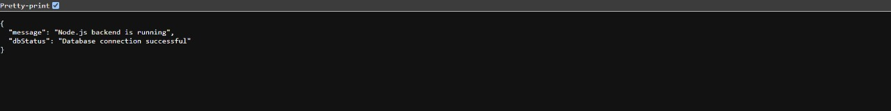
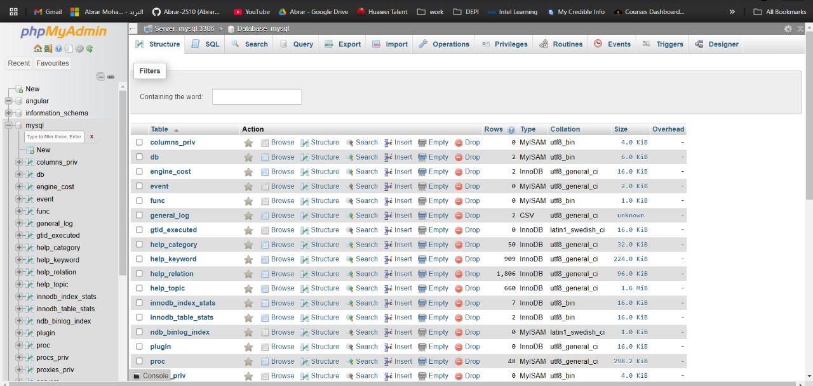

## Kubernetes Application Deployment with Ansible

This project automates the provisioning of a Kubernetes cluster with **1 master node** and **1 worker node** on aws. It also sets up a 3-tier application (Frontend, Backend, and MySQL) with Kubernetes and exposes the Angular app using NGINX Ingress Controller. The project leverages **Ansible** for automation and **Docker** for containerization.

---

## Project Structure

.png)

```bash

├── ansible/
│   ├── play.yml                # Ansible playbook for provisioning and deploying the application
│   ├── inventory.ini               # Inventory file with master and worker node details
|   ├── ansible.cfg
    ├── secrets.yml
│   ├── roles/
│   │   ├── master/                 # Role for master node setup
│   │   │   ├── tasks/
│   │   │   │   └── main.yml        # Tasks to configure the master node
│   │   ├── worker/                 # Role for worker node setup
│   │   │   ├── tasks/
│   │   │   │   └── main.yml        # Tasks to configure the worker node
│   │   ├── common/                 # Common tasks for all nodes
│   │   │   ├── tasks/
│   │   │   │   └── main.yml        # Common tasks like installing kubectl    
│
├── k8s/                            # Directory containing all Kubernetes resources (YAML)
│   ├── frontend-service.yaml       # Kubernetes Service for Frontend
│   ├── frontend-ingress.yaml       # Ingress to expose Frontend
│   └── mysql-pvc.yaml              # Persistent Volume Claim for MySQL
|   ├── frontend-service.yaml       # Kubernetes YAML for frontend service
│   ├── frontend-ingress.yaml       # Kubernetes YAML for frontend ingress
│   └── backend-service.yaml        # Kubernetes YAML for backend service
│   └── mysql-deployment.yaml       # Kubernetes YAML for MySQL deployment
│
├── depi-angular-app/
│   ├── Dockerfile-frontend         # Dockerfile for Frontend (Multi-stage)
│   ├── Dockerfile-backend          # Dockerfile for Backend
│   ├── docker-compose.yml          # Docker Compose file for local deployment
│
└── README.md                       # Project Documentation
```


### **High-Level Architecture:**

1. **Kubernetes Cluster:**
   - **Master Node**: Controls the Kubernetes cluster and manages scheduling, deployments, and resources.
   - **Worker Node**: Runs application pods and provides resources for running containers.

2. **3-Tier Application:**
   - **Frontend**: Angular-based web application built and served through NGINX.
   - **Backend**: API server that interacts with the frontend and the database.
   - **MySQL**: Database service to store data.

3. **Ingress Controller:**
   - Exposes the Angular app to clients over HTTP/HTTPS using NGINX Ingress.

4. **Docker Registry (Bonus):**
   - Private Docker registry is set up to host Docker images securely.

### **Project Components:**

1. **Ansible Playbook** (`ansible/playbook.yml`): 
   - Automates the setup of Kubernetes on both master and worker nodes.
   - Deploys the 3-tier application and configures Ingress to expose the Angular frontend.

2. **Kubernetes Resources** (`k8s/`):
   - Kubernetes YAML files for services, deployments, and Ingress.

3. **Docker**:
   - Multi-stage Dockerfiles for both frontend and backend applications.
   - Docker Compose file for local development of the 3-tier application.

---

## **Inbound Security Groups for Ports**

To ensure that your Kubernetes cluster and application are accessible, configure the following inbound security group rules:

### **Kubernetes Cluster Ports**:
1. **Master Node**:
   - **Port 6443**: Kubernetes API server communication
   - **Port 10250**: Kubelet API communication
   - **Port 10251**: Scheduler communication
   - **Port 10252**: Controller manager communication

2. **Worker Node**:
   - **Port 10250**: Kubelet API communication
   - **Port 30000-32767**: NodePort services (if using NodePort for application access)

### **Application Ports**:
1. **NGINX Ingress**:
   - **Port 80**: HTTP traffic to expose the Angular app
   - **Port 443**: HTTPS traffic (if SSL is enabled)

2. **Frontend (Angular)**:
   - **Port 4200** (local): For development purposes, exposed via Docker

3. **Backend (API)**:
   - **Port 8080** (local): For backend API communication, exposed via Docker

4. **MySQL**:
   - **Port 3306**: Database access for the backend service

---


### **Steps**:
1. **Install Docker** on your registry server.
2. **Configure the Docker Registry** using the `docker registry` command.
3. **Push the Docker Images** (e.g., frontend and backend images) to the registry.
4. **Configure Kubernetes to pull images** from your private registry using secrets or service accounts.

---

## **How to Use This Project**

### **Step 1: Setup Kubernetes Cluster with Ansible**
Run the following Ansible command to provision the Kubernetes cluster with 1 master and 1 worker node:

```bash
ansible-playbook -i ansible/inventory.ini ansible/playbook.yml 
```
### **Step 2: U can Run Your Angular Application (locally)**

```bash
ng serve --open
```
### **Step 3: U can Run Your Angular Application (externally)**

```bash
kubectl get ingress
```

## project screens connected







