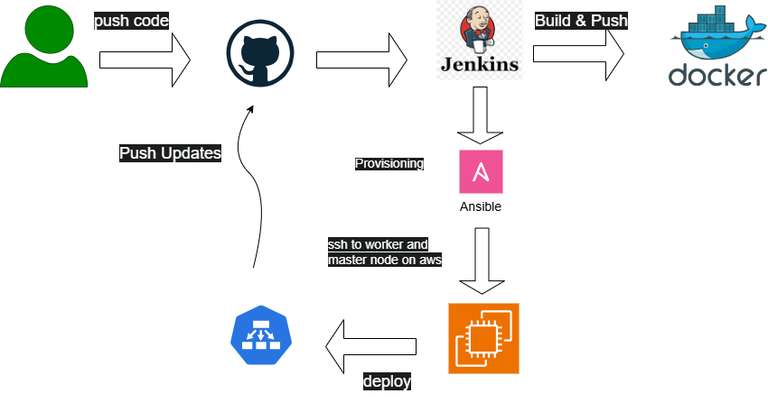
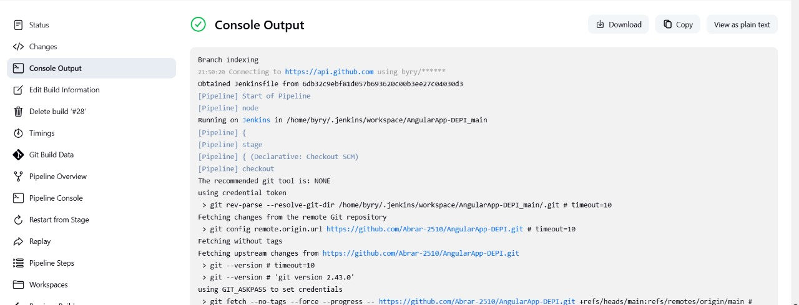

## Kubernetes Application Deployment with Ansible and Helm

This project automates the provisioning of a Kubernetes cluster with **1 master node** and **1 worker node** on AWS. It also sets up a 3-tier application (Frontend, Backend, and MySQL) with Kubernetes and exposes the Angular app using NGINX Ingress Controller. The project leverages **Ansible** for automation, **Docker** for containerization, **Helm** for Kubernetes package management, and **Jenkins** for automating Docker image builds and pushes.

---

## Project Structure




### **High-Level Architecture:**

1. **Kubernetes Cluster:**
   - **Master Node**: Controls the Kubernetes cluster and manages scheduling, deployments, and resources.
   - **Worker Node**: Runs application pods and provides resources for running containers.

2. **3-Tier Application:**
   - **Frontend**: Angular-based web application built and served through NGINX.
   - **Backend**: API server that interacts with the frontend and the database.
   - **MySQL**: Database service to store data.

3. **Helm Deployment:**
   - Manages Kubernetes resources efficiently using Helm templates.
   - Simplifies updates, rollbacks, and configuration management.

4. **Ingress Controller:**
   - Exposes the Angular app to clients over HTTP/HTTPS using NGINX Ingress.

5. **Docker Registry:**
   - Private Docker registry is set up to host Docker images securely.

6. **Jenkins (CI/CD for Docker & Helm):**
   - Jenkins pipeline automates the building and pushing of Docker images to a container registry.
   - Automates Helm deployments to Kubernetes.

---

## **Inbound Security Groups for Ports**

To ensure that your Kubernetes cluster and application are accessible, configure the following inbound security group rules:

### **Kubernetes Cluster Ports**:
1. **Master Node**:
   - **Port 6443**: Kubernetes API server communication
   - **Port 10250**: Kubelet API communication
   - **Port 10251**: Scheduler communication
   - **Port 10252**: Controller manager communication

2. **Worker Node**:
   - **Port 10250**: Kubelet API communication
   - **Port 30000-32767**: NodePort services (if using NodePort for application access)

### **Application Ports**:
1. **NGINX Ingress**:
   - **Port 80**: HTTP traffic to expose the Angular app
   - **Port 443**: HTTPS traffic (if SSL is enabled)

2. **Frontend (Angular)**:
   - **Port 4200** (local): For development purposes, exposed via Docker

3. **Backend (API)**:
   - **Port 8080** (local): For backend API communication, exposed via Docker

4. **MySQL**:
   - **Port 3306**: Database access for the backend service

---

## **Deploying with Ansible and Helm**

### **Step 1: Setup Kubernetes Cluster with Ansible**
Run the following Ansible command to provision the Kubernetes cluster with 1 master and 1 worker node:

```bash
ansible-playbook -i ansible/inventory.ini ansible/playbook.yml 
```


---

## ✅ Benefits of Using Helm

### 1️⃣ **Parameterization & Reusability**  
- Avoid hardcoding values inside YAML files.
- Instead of writing `image: backend:v1.0` in `deployment.yaml`, use:
  ```yaml
  image: "{{ .Values.backend.image.repository }}:{{ .Values.backend.image.tag }}"
  ```
- Deploy **different versions** or **environments (dev/staging/prod)** using Helm values.


### 3️⃣ **Templating for Customization**  
- Instead of managing **separate YAML files for different environments**, pass values dynamically:
  ```sh
  helm upgrade --install angularapp helm-chart --set backend.image.tag=latest
  ```
- Easily update configurations (scaling, ports, environment variables) without editing YAML manually.

---


### 4️⃣ **Rollback & Version Control**  
- If a deployment fails, quickly roll back:
  ```sh
  helm rollback angularapp 1
  ```
- Kubernetes alone **does not track versions** as easily as Helm.

---

### 5️⃣ **Easier CI/CD Integration**  
- In Jenkins, instead of manually applying `.yml` files, use a **single Helm command**.
- Automate versioning:
  ```sh
  helm upgrade --install angularapp helm-chart --set backend.image.tag=$BUILD_NUMBER
  ```

---


## 🚀 Deploying with Helm

```sh
helm create helm-chart
```
Modify `helm-chart/values.yaml` to store configurable values.

---

```sh
helm upgrade --install angularapp helm-chart --namespace angularapp --create-namespace
```

For rollbacks:
```sh
helm rollback angularapp 1
```


---

## 🎯 Conclusion
✅ **Helm makes Kubernetes deployments easier, reusable, and CI/CD-friendly!**  
🚀 **Delete raw Kubernetes YAML files and use Helm instead.**  
🔹 **Use `values.yaml` instead of hardcoding values.**  
🔹 **Deploy with `helm upgrade --install` instead of applying YAML manually.**  


To **deploy and access your application on** `angularapp.example.com`, follow these **step-by-step** Helm and Kubernetes commands:  

---

### **1️⃣ Deploy the Helm Chart**
Run the following **Helm command** to install or update your application with the `values.yml` file:
```sh
helm upgrade --install angularapp ./angularapp-chart -f angularapp-chart/values.yaml -n angularapp
```
🔹 **Why?** This ensures that **all resources** (Frontend, Backend, MySQL, Ingress, PVC) are deployed correctly.

---

### **2️⃣ Verify that All Pods are Running**
Check the status of your Kubernetes pods:
```sh
kubectl get pods -n angularapp
```
🔹 **Why?** This ensures that your frontend, backend, and MySQL services are running.

If any pods are stuck in `CrashLoopBackOff` or `Pending`, check logs:
```sh
kubectl logs <POD_NAME> -n angularapp
```
or describe the pod:
```sh
kubectl describe pod <POD_NAME> -n angularapp
```

---

### **3️⃣ Verify Ingress and Service**
Check if your **Ingress Controller** is running:
```sh
kubectl get pods -n angularapp | grep nginx-ingress-controller
```
If the **Ingress Controller** is missing, deploy **NGINX Ingress** (if not already installed):
```sh
helm repo add ingress-nginx https://kubernetes.github.io/ingress-nginx
helm repo update
helm install nginx-ingress ingress-nginx/ingress-nginx --set controller.service.type=LoadBalancer
```
---

### **4️⃣ Check the Ingress Resource**
To verify that your **Ingress is created**, run:
```sh
kubectl get ingress -n angularapp
```
You should see an output like:
```
NAME                 CLASS    HOSTS                    ADDRESS        PORTS   AGE
angularapp-ingress   <none>   angularapp.example.com   <EXTERNAL-IP>  80      10m
```
🔹 **Why?** This confirms that your `angularapp-ingress` is available.

---

### **5️⃣ Get the External IP**
If using a **LoadBalancer**, find its external IP:
```sh
kubectl get svc -n angularapp
```
Look for the `nginx-ingress-service` external IP.

If it's `pending`, use:
```sh
kubectl get svc -n ingress-nginx
```
🔹 **Why?** You need the IP to update DNS.

---

### **6️⃣ Update Your `/etc/hosts` File (For Local Testing)**
If you don't have a **public DNS** setup, you can manually map the hostname:
```sh
sudo nano /etc/hosts
```
Add this line (replace `<EXTERNAL-IP>` with the Ingress service IP):
```
<EXTERNAL-IP> angularapp.example.com
```
Save and exit.

---

### **7️⃣ Access the Application**
Now, open your browser and visit:
```
http://angularapp.example.com  
```
🔹 **Why?** This should now correctly route traffic via NGINX Ingress to your frontend.
### **Step 6: Debugging Issues**

#### **Check Pod Logs**
```bash
kubectl logs <POD_NAME> -n angularapp
```

#### **Check Service and Endpoint Mapping**
```bash
kubectl get svc -n angularapp
kubectl get endpoints -n angularapp
```

#### **Check Ingress Logs**
```bash
kubectl logs -n ingress-nginx -l app.kubernetes.io/name=ingress-nginx
```

#### **Ensure Backend is Reachable from Frontend**
```bash
kubectl exec -it <FRONTEND_POD_NAME> -n angularapp -- curl -I http://backend-service:3000
```

---

## 🎯 **Conclusion**
✅ **Use Ansible to set up the Kubernetes cluster**  
✅ **Deploy applications efficiently with Helm**  
✅ **Use `helm upgrade --install` instead of applying raw YAML files manually**  
✅ **Monitor and debug with `kubectl get pods`, `kubectl logs`, and `kubectl get ingress`**  

## Project Screens Connected


### Git Push from Jenkins


This image captures the Jenkins pipeline stage where code changes are pushed to the Git repository, ensuring version control.
###  Jenkins pipeline


