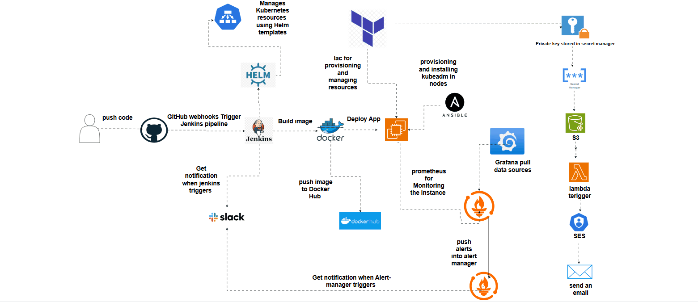
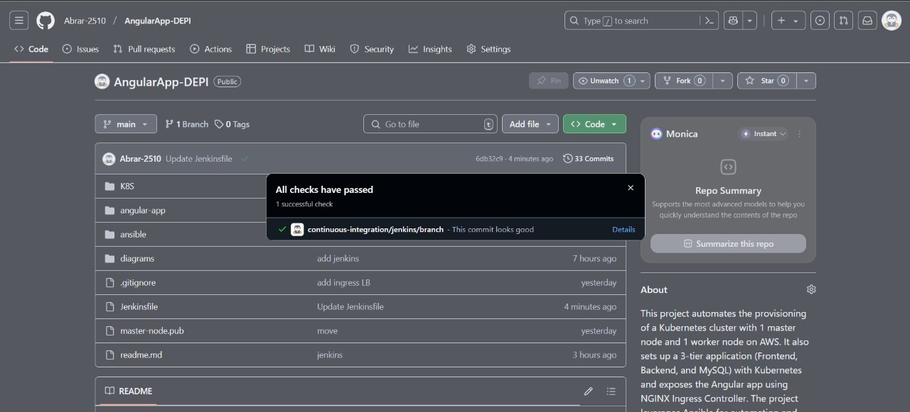
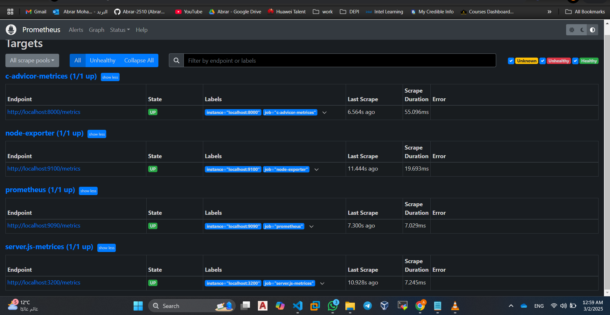
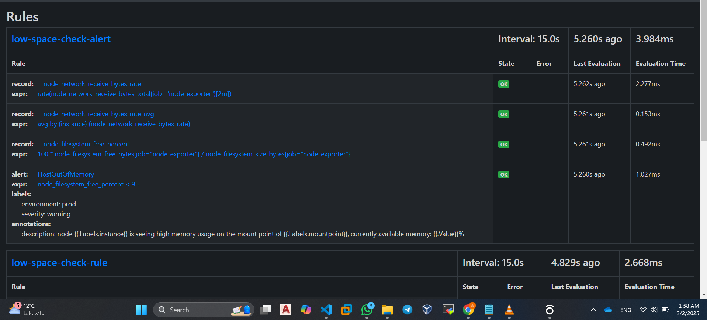
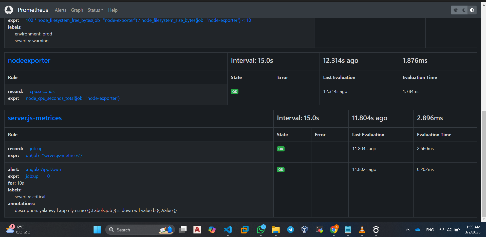
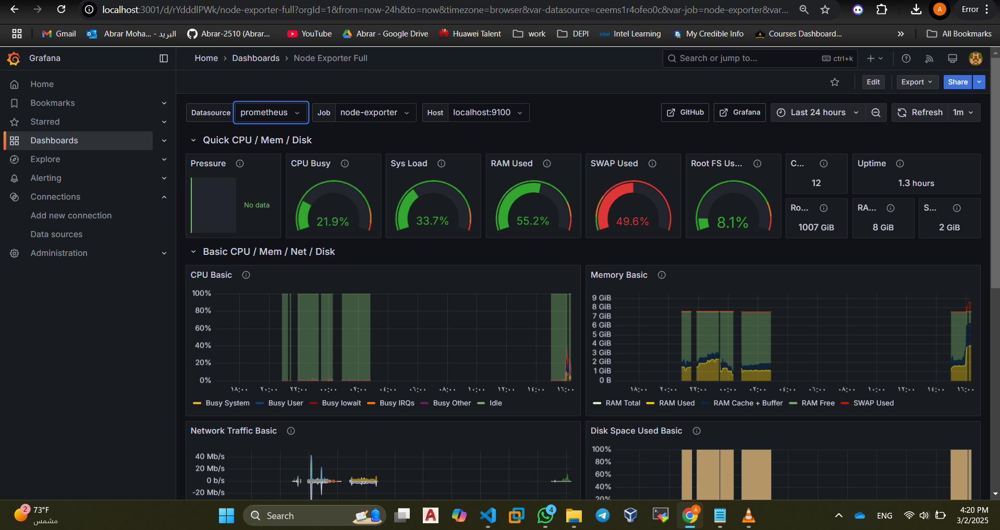
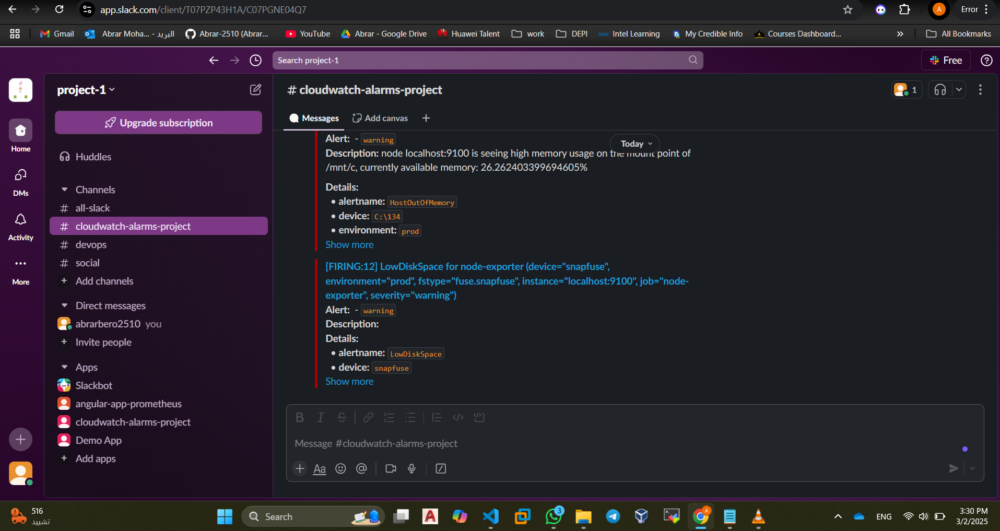

## Kubernetes Application Deployment with Ansible and Helm

This project automates the provisioning of a Kubernetes cluster with **1 master node** and **1 worker node** on AWS. It also sets up a 3-tier application (Frontend, Backend, and MySQL) with Kubernetes and exposes the Angular app using NGINX Ingress Controller. The project leverages **Ansible** for automation, **Docker** for containerization, **Helm** for Kubernetes package management, and **Jenkins** for automating Docker image builds and pushes.

---

## Project Structure



### **High-Level Architecture:**

1. **Kubernetes Cluster:**
   - **Master Node**: Controls the Kubernetes cluster and manages scheduling, deployments, and resources.
   - **Worker Node**: Runs application pods and provides resources for running containers.

2. **3-Tier Application:**
   - **Frontend**: Angular-based web application built and served through NGINX.
   - **Backend**: API server that interacts with the frontend and the database.
   - **MySQL**: Database service to store data.

3. **Helm Deployment:**
   - Manages Kubernetes resources using Helm templates.

4. **Ingress Controller:**
   - Exposes the Angular app to clients over HTTP/HTTPS using NGINX Ingress.

5. **Docker Registry:**
   - Private Docker registry is set up to host Docker images securely.

6. **Jenkins (CI/CD for Docker & Helm):**
   - GitHub webhooks trigger Jenkins pipeline.
   - Jenkins builds Docker images, pushes them to Docker Hub, and deploys the application using Helm.

7. **Infrastructure Automation:**
   - **Terraform**: Infrastructure as code (IaC) for provisioning and managing AWS resources.
   - **Ansible**: Automates provisioning and installing Kubernetes (`kubeadm`) on nodes.

8. **Monitoring & Alerts:**
   - **Prometheus**: Monitors Kubernetes resources and application metrics.
   - **Grafana**: Pulls data from Prometheus for visualization.
   - **Alert Manager**: Pushes alerts and triggers notifications.
   - **Slack & AWS SES**: Send notifications when Jenkins or Alert Manager triggers an event.
   - **AWS Lambda**: Automates responses based on triggered alerts.

---

## **Inbound Security Groups for Ports**

To ensure that your Kubernetes cluster and application are accessible, configure the following inbound security group rules:

### **Kubernetes Cluster Ports**:
1. **Master Node**:
   - **Port 6443**: Kubernetes API server communication
   - **Port 10250**: Kubelet API communication
   - **Port 10251**: Scheduler communication
   - **Port 10252**: Controller manager communication

2. **Worker Node**:
   - **Port 10250**: Kubelet API communication
   - **Port 30000-32767**: NodePort services (if using NodePort for application access)

### **Application Ports**:
1. **NGINX Ingress**:
   - **Port 80**: HTTP traffic to expose the Angular app
   - **Port 443**: HTTPS traffic (if SSL is enabled)

2. **Frontend (Angular)**:
   - **Port 4200** (local): For development purposes, exposed via Docker

3. **Backend (API)**:
   - **Port 8080** (local): For backend API communication, exposed via Docker

4. **MySQL**:
   - **Port 3306**: Database access for the backend service

---

## **Deploying with Ansible and Helm**

### **Step 1: Setup Kubernetes Cluster with Ansible**
Run the following Ansible command to provision the Kubernetes cluster with 1 master and 1 worker node:

```bash
ansible-playbook -i ansible/inventory.ini ansible/playbook.yml 
```

---

## 🚀 Deploying with Helm

```sh
helm create helm-chart
```
Modify `helm-chart/values.yaml` to store configurable values.

```sh
helm upgrade --install angularapp helm-chart --namespace angularapp --create-namespace
```

For rollbacks:
```sh
helm rollback angularapp 1
```

---

## Project Screens Connected


### **Jenkins Pipeline & Monitoring**

#### **Git Push from Jenkins**


#### **Jenkins CI/CD Pipeline Execution**


#### **Prometheus Rules for Alerting**


#### **Prometheus Metrics Dashboard**


#### **Grafana Monitoring Dashboard**


#### **Slack Notification Integration**


---

## 🎯 **Final Thoughts**
✅ **Ansible automates Kubernetes cluster setup.**  
✅ **Helm simplifies deployments and version control.**  
✅ **Jenkins automates CI/CD pipelines for seamless application updates.**  
✅ **Prometheus & Grafana ensure real-time monitoring & alerting.**  
✅ **Slack notifications provide immediate deployment updates.**  

This project demonstrates a complete DevOps pipeline from infrastructure automation to application deployment and monitoring!
